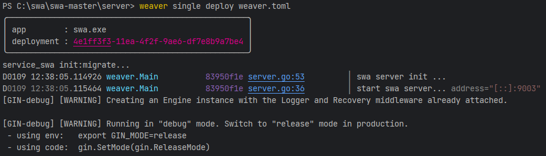
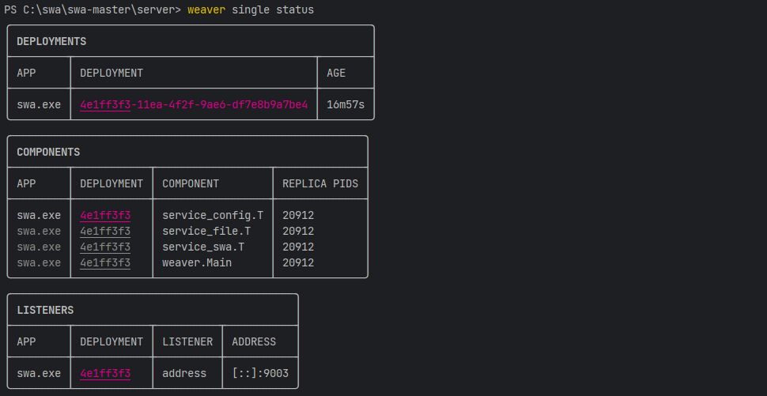
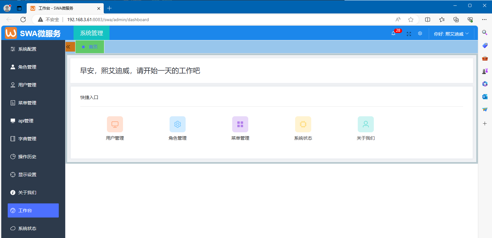

# go微服务管理平台SWA (Service Weaver Admin)

#### 介绍

```
基于Google公司Service Weaver微服务架构的开发平台 (go语言+vue)。
该架构天生微服务，单体编码,不需编写和调试微服务之间接口,
自动微服务拆分部署。适合快速定制开发商用软件。基于本平台的数据中台即将开源，敬请期待。

开源地址1:https://github.com/go-swa/swa
开源地址2:https://gitee.com/go-swa/swa

技术交流,软件服务,联系方式:
 微信号：xidwauthor 
 QQ群：547882356 
 邮箱：xidwauthor@sina.com 

基于go-swa的数据中台(数据仓库+数据治理+数据服务)即将开源,敬请期待.
```

#### 软件架构

```
Service Weaver是Google开源的一个编程框架(programming framework) ，用于编写、部署和管理用Go开发的分布式应用程序。

使用Service Weaver，你可以像编写在本地机器上运行的传统单进程Go可执行文件一样编写应用程序。然后，将其部署到云中，
该框架会将其分解为一组微服务，并将其与云提供商(主要是k8s)集成（如监控、跟踪、日志等）。简单来说，就是“以单体形式编码，
以微服务形式部署”。

Google开源的Service Weaver本就是为解决微服务架构在实践中出现的诸多问题而提出的创新思路与实验，为此它提出并实现了三个核心原则：

1.在构建阶段，开发人员只需编写模块化的单体程序。

2.在首次部署和运行阶段，Service Weaver会将逻辑组件分配给物理进程，可以是本地的一个进程，也可以是多个进程，
当然最主流的还是分配给运行在公有云提供商k8s的不同pod。

3.以原子方式升级变更应用，彻底杜绝应用的不同版本间的交互。
```

#### 安装教程

```
1.  后端安装依赖（开发环境：golang+VSC)：
    cd swa-master/server
    go mod tidy

2.  前端安装依赖（开发环境：nodejs+VSC)：
    cd swa-master/web
    npm install --registry=https://registry.npm.taobao.org

3.  软件运行之前需安装mysql数据库（默认mysql，也支持postgresql及其兼容系列数据库）

4.  软件运行之前，需要使用初始化工具swa-tools初始化数据库数据

5.  更多安装使用说明,参见server和web文件夹下的readme文件
```

#### 使用说明

```
1.  后端运行：
    cd swa-master/server
    weaver single deploy weaver.toml
    启动微服务时如下：
```



```
    查看微服务运行状态：
```



```
2.  前端运行：
    cd swa-master/web
    npm run dev
    登录用户及密码：admin/123456
    正常启动后，结果如下：
```



#### 参与贡献

```
1.  Fork 本仓库
2.  新建 Feat_xxx 分支
3.  提交代码
4.  新建 Pull Request
```