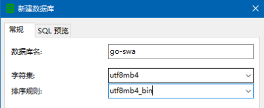
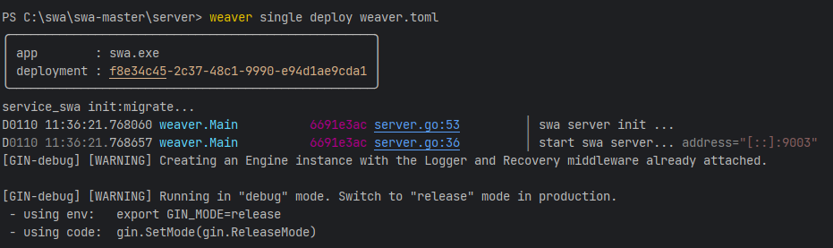
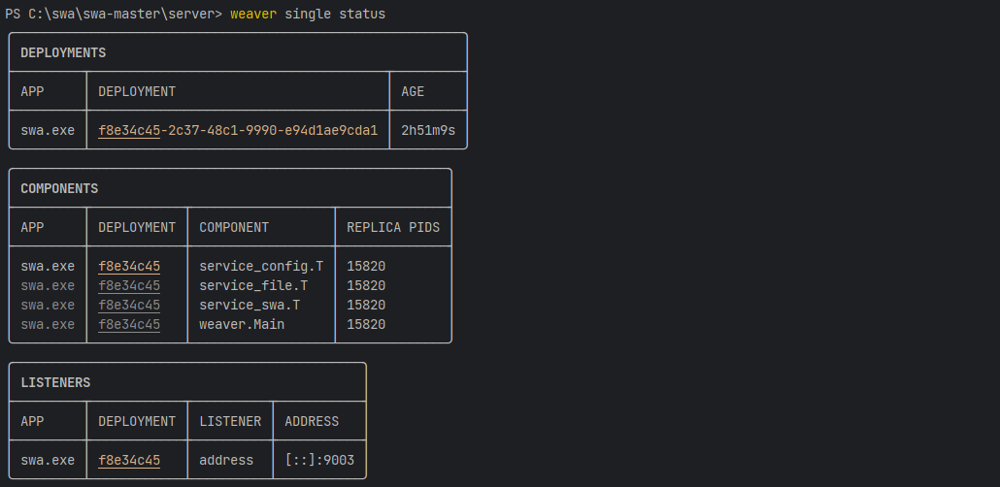
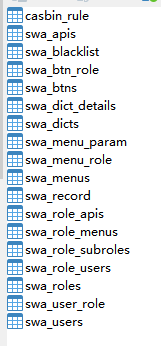
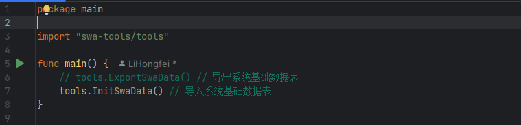

### 环境安装

```
开发环境需要如下：
1.数据库:mysql并保证可远程访问
    #更改加密方式(navcat才能远程登录)
    ALTER USER 'root'@'%' IDENTIFIED WITH mysql_native_password BY '123456';
2.缓存数据库：redis
3.golang 版本>1.21
4.编辑器：goland+webStorm或VSC
5.操作系统：windows或linux均可
环境搭建可参考百度
```

### 修改配置文件匹配数据库

```
修改./server/config.toml文件中的[gormDB]部分并保存
[gormDB]
db-type = "mysql"       # 数据库类型
ip = "192.168.3.xxx"    # 数据库ip
port = "3306"           # 数据库port
username = "root"       # 数据库用户名
password = "12345"      # 数据库密码
db-name = "go-swa"      # 数据库库名
```

### 数据库建库

```
避免越权和保证信息安全,规避风险，创建数据须由数据库管理员进行。
所以新版本取消了自动创建数据库功能。
登录mysql数据库，新建go-swa数据库,如下
```



### 安装service weaver(windows)

```shell
go env -w CGO_ENABLED=1
go env -w GOOS=windows
go env -w GOARCH=amd64
go env -w GOFLAGS=-buildvcs=false
go install github.com/ServiceWeaver/weaver/cmd/weaver@latest
```

### 编译并运行（在server目录执行）

在server目录下逐个组件编译并运行

```shell
go env -w CGO_ENABLED=1
go env -w GOOS=windows
go env -w GOARCH=amd64
go env -w GOFLAGS=-buildvcs=false
go mod tidy
cd .\service\service_config\
weaver generate
cd ../..
cd .\service\service_file\
weaver generate
cd ../..
cd .\service\service_swa\
weaver generate
cd ../..
cd .\frontend\
weaver generate
cd ..
weaver generate
go build -o swa.exe
weaver single deploy weaver.toml
```

运行结果会显示如下


### 查看单进程运行状态(另起cmd窗口)

```shell
weaver single status
```

状态结果会显示如下


### 查看数据库表状态,下列数据表应该已经自动生成



### 导入swa管理平台基础数据(注意与swa的发行版本一致)

```
注意：只有在平台基本数据库go-swa的所有表都是空的情况下才能执行初始化。
当前没有对表的数据进行判断，如重复操作会造成部分没有主键的表的数据重复。
要重新初始化，可以先对每个表进行"截断"操作
```

```
# gitee下载swa初始化工具
https://gitee.com/go-swa/swa-tools
```

```
# 修改配置文件init.yaml与当前的数据库配置一致
db-type: mysql
ip: 192.168.3.xx
port: "3306"
username: root
password: 12345
db-name: go-swa
```

```
注意选择"导入"功能后执行(默认选择导入功能)
导出功能是为了生产版本需要。（安全生产很重要!!!）
执行后注意检查打印输出的日志，有没有错误信息
```



### 检查数据中go-swa中的表，是否所有表中都有数据

```
至次,第一次启动server完毕！！！
后续日常开发后编译运行,参考"编译运行.md"即可
```